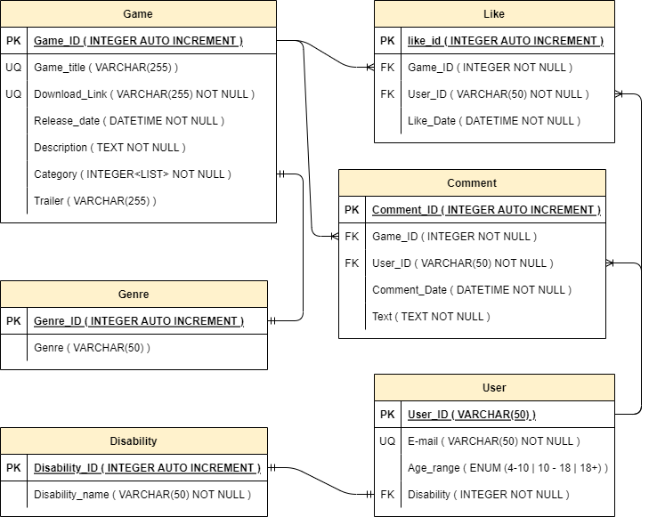

# Data base conceptualization

| Entity | Attributes | Relation |
| --- | --- | --- |
| Game | Name (PK)   Description   Link (UQ)   Likes   Comments (Cat) | Likes - Many to One   Comments - One to one |
| User | ID (PK)   E-mail (UQ)   Age range (CAt)   Disability (CAT) |  |
| Comment | Text   Date (PK)   Game (FK)   User (FK)   Commenter (FK)   Upvotes   Downvotes | Text - One to one   Upvote/Downvote - Many to one |
| Age Range | 4 - 10   10 - 18   18+ | Cataloge |

 

